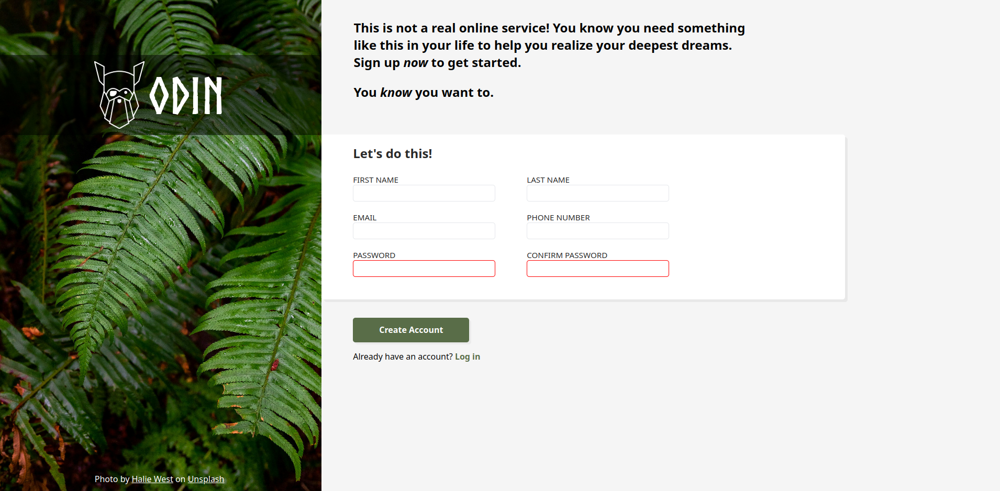

# sign-up-form

# Links
- [Live preview](https://azanra.github.io/sign-up-form/)
- [Assignment page](https://www.theodinproject.com/lessons/node-path-intermediate-html-and-css-sign-up-form)

# About
This project focus on creating the form control with the 
correct input type and attribute that match the data that
we need, and the constraint validation attribute that set
by the design. Based on the design set on the assignment
looks like the one that have constraint set is only password
and confirm password with required attribute. Other option
is pattern attribute, but i don't use it on this project.
for the rest of them setting the minlength and maxlength
seems right for me.

# Review
The pattern attribute is using regular expression, because
it's another deep rabbit hole, i think i will visit it again 
later in the future if needed.

# Screenshot
